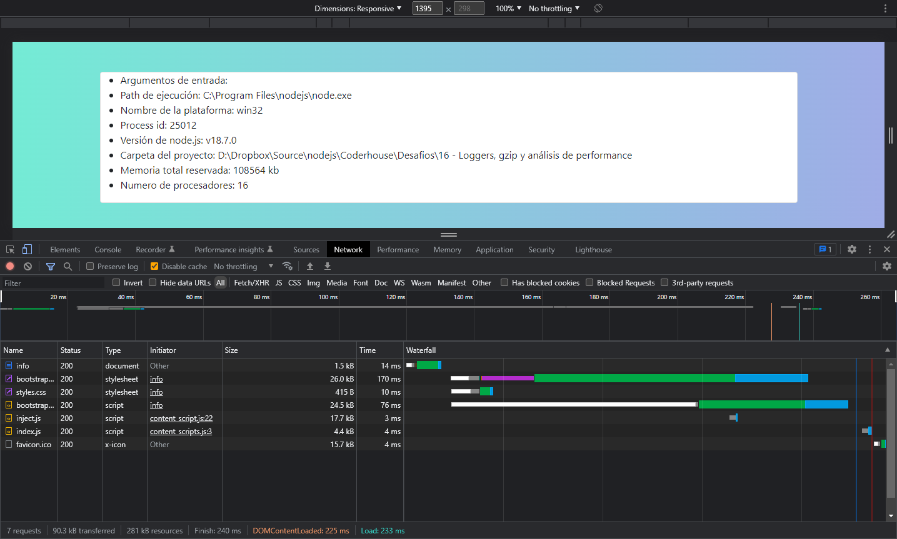
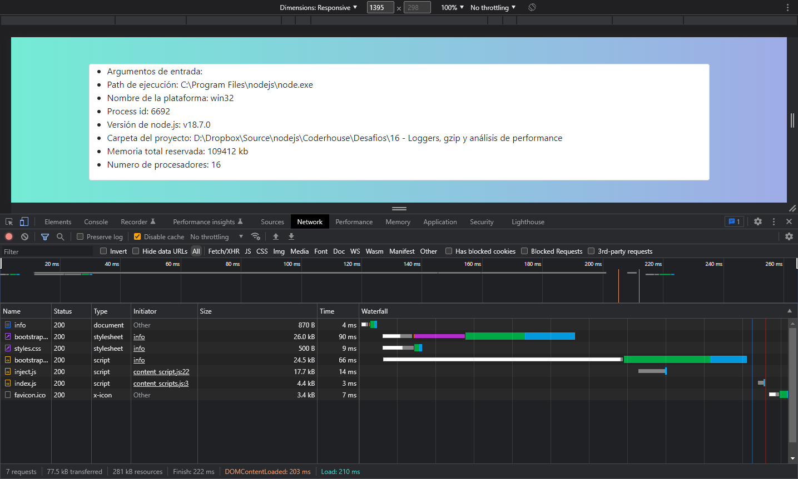

## **Backend Coderhouse - Desafío 16 - Clase 32: Loggers, gzip y análisis de performance**

### Loggers Y Gzip
**Consigna:**
Incorporar al proyecto de servidor de trabajo la compresión gzip.
Verificar sobre la ruta /info con y sin compresión, la diferencia de cantidad de bytes devueltos en un caso y otro.
Luego implementar loggueo (con alguna librería vista en clase) que registre lo siguiente:
 - Ruta y método de todas las peticiones recibidas por el servidor (info)
 - Ruta y método de las peticiones a rutas inexistentes en el servidor (warning)
 - Errores lanzados por las apis de mensajes y productos, únicamente (error)

Considerar el siguiente criterio:
 - Loggear todos los niveles a consola (info, warning y error)
 - Registrar sólo los logs de warning a un archivo llamada warn.log
 - Enviar sólo los logs de error a un archivo llamada error.log

### Analisis completo de performance
**Consigna:**
Luego, realizar el análisis completo de performance del servidor con el que venimos trabajando.
Vamos a trabajar sobre la ruta '/info', en modo fork, agregando ó extrayendo un console.log de la información colectada antes de devolverla al cliente. Además desactivaremos el child_process de la ruta '/randoms'
Para ambas condiciones (con o sin console.log) en la ruta '/info' OBTENER:

 1. El perfilamiento del servidor, realizando el test con --prof de node.js. Analizar los resultados obtenidos luego de procesarlos con --prof-process.
Utilizaremos como test de carga Artillery en línea de comandos, emulando 50 conexiones concurrentes con 20 request por cada una. Extraer un reporte con los resultados en archivo de texto.
Luego utilizaremos Autocannon en línea de comandos, emulando 100 conexiones concurrentes realizadas en un tiempo de 20 segundos. Extraer un reporte con los resultados (puede ser un print screen de la consola)
 2. El perfilamiento del servidor con el modo inspector de node.js --inspect. Revisar el tiempo de los procesos menos performantes sobre el archivo fuente de inspección.
 3. El diagrama de flama con 0x, emulando la carga con Autocannon con los mismos parámetros anteriores.

Realizar un informe en formato pdf sobre las pruebas realizadas incluyendo los resultados de todos los test (texto e imágenes).

👉 Al final incluir la conclusión obtenida a partir del análisis de los datos.


**Detalles del desafio:**

### - Ruta /info con y sin compresión:
El tamaño de la respuesta sin comprimir fue 1.5k y el de la comprimida 870b lo que representa una compresión de 56%.

Resultado sin compresión:


Resultado con compresión:


### - Logging:
La librería seleccionada fue **winston**.

### - Perfilamiento
Comando para perfilar con node:
`node --prof src/server.js`

**Artillery**, con los parámetros que proponía el desafío no se notaban diferencias entre sin y con console, por lo que para los test de artillery use los valores propuestos multiplicados por 4.
```
artillery quick --count 80 -n 200 "http://localhost:8080/info/log" > artillery_con_console.txt
artillery quick --count 80 -n 200 "http://localhost:8080/info" > artillery_sin_console.txt
```
*Analisis*:
```
node --prof-process isolate-con-console.log > result_con_console.txt
node --prof-process isolate-sin-console.log > result_sin_console.txt
```
Las conclusiones de los analisis de performance se pueden ver en: [reporte.pdf](./reporte.pdf)
